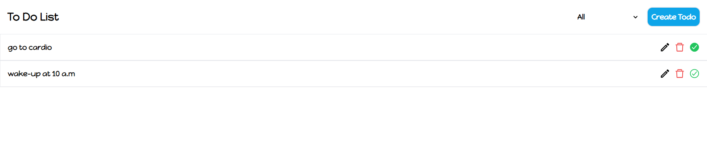

# React To-Do List Application

## Introduction
This is a simple React To-Do List application that allows users to add, remove, and mark tasks as completed. The app also supports optional sorting and filtering of tasks and integrates with localStorage to persist tasks across sessions.

## Features
- ✅ Add tasks
- 🗑️ Remove tasks
- ✔️ Mark tasks as completed
- 📅 Optional sorting (by date, alphabetical)
- 🔍 Optional filtering (all, completed, not completed)
- 💾 LocalStorage integration for task persistence

## Getting Started

### Prerequisites
- Node.js
- npm or yarn

### Installation
1. Clone the repository:
   ```bash
   git clone https://github.com/harshkhavale/celebal-internship/week-02.git
   cd react-todo-list
   ```

2. Install dependencies:
   ```bash
   npm install
   # or
   yarn install
   ```

3. Start the development server:
   ```bash
   npm start
   # or
   yarn start
   ```

The application should now be running at `http://localhost:3000`.

## Project Structure
```
react-todo-list/
├── public/
│   ├── index.html
│   └── ...
├── src/
│   ├── components/
│   │   ├── ToDoItem.js
│   │   ├── ToDoList.js
│   │   └── mod/
│   │       └── AddToDo.js
│   ├── App.js
│   ├── index.js
│   └── ...
├── package.json
└── README.md
```

## Usage

### Adding a Task
1. Click the "Create Todo" button to open the task creation modal.
2. Enter a task title and click "Add" to add the task to the list.

### Removing a Task
1. Click the 🗑️ icon next to the task you want to remove.

### Marking a Task as Completed
1. Click the ✔️ icon next to the task you want to mark as completed.

### Editing a Task
1. Click the ✏️ icon next to the task you want to edit.
2. Modify the task title and click "Save" to save the changes.

### Sorting and Filtering
1. Use the dropdown menus to sort tasks by date or alphabetical order and filter tasks by all, completed, or not completed.

## Testing Guide
1. **Add Task:**
   - Click the "Create Todo" button.
   - Enter a valid task title.
   - Click "Add" and verify the task appears in the list.

2. **Remove Task:**
   - Click the 🗑️ icon next to a task.
   - Verify the task is removed from the list.

3. **Mark Task as Completed:**
   - Click the ✔️ icon next to a task.
   - Verify the task is marked as completed.

4. **Edit Task:**
   - Click the ✏️ icon next to a task.
   - Modify the task title.
   - Click "Save" and verify the task is updated.

5. **Sort Tasks:**
   - Use the sort dropdown to sort tasks by date or alphabetical order.
   - Verify the tasks are sorted correctly.

6. **Filter Tasks:**
   - Use the filter dropdown to filter tasks by all, completed, or not completed.
   - Verify the tasks are filtered correctly.

7. **LocalStorage Persistence:**
   - Refresh the page and verify the tasks persist.


---

